# DPROJ Manager

> A side-by-side diff and migration tool for Delphi `.dproj` files — and other
> Delphi/MSBuild XML project artefacts.

[](LICENSE)
[](https://www.python.org/)
[](https://developer.mozilla.org/en-US/docs/Web/JavaScript)
[](#requirements)

DPROJ Manager helps you compare, normalize, and merge Delphi project files
across RAD Studio versions, branches, or experimental forks. It opens two
`.dproj` files side-by-side, highlights differences down to the individual
`<PropertyGroup>` / property level, and lets you copy values from one side to
the other with a single click — without touching the IDE.

> **Note on technology**: despite the focus on Delphi project files, DPROJ
> Manager itself is **not** a Delphi application. It is written in **Python**
> (backend, parsing, normalization) plus **vanilla HTML/CSS/JavaScript**
> (frontend), bundled into a standalone Windows EXE. No Delphi is required to
> run or build the tool.

---

## Features

### Diff & merge

- **Side-by-side 3-column layout**: left file · apply buttons · right file. All
  three columns scroll in lockstep, and rows are pixel-aligned per
  `PropertyGroup` and per property.
- **Per-property apply (`→` / `←`)**: copy a value from one side to the other
  with one click. **Reset (`↺`)** undoes the change without reloading.
- **Sub-element granularity**: for token lists (e.g. `DCC_UnitSearchPath`) and
  key-value properties (e.g. `VerInfo_Keys`), individual tokens / KV pairs can
  be applied or reset independently — no need to copy the whole property.
- **Character-level diff highlighting** inside modified token chips and KV
  values: shared prefix / suffix dimmed, divergent middle highlighted.
- **Enable / disable per property**: a checkbox per row marks a property for
  removal on Save (useful for "this setting doesn't belong in this version").

### Smart normalization

- **Canonical PropertyGroup ordering** (optional, MSBuild-safe):
  `Base` → `Base_<platform>` → `Cfg_N` → `Cfg_N_<platform>`, platforms
  alphabetical. Tested round-trip with RAD Studio 13 (Patch 1).
- **ProjectExtensions normalization** (optional): recursively sorts the
  `ProjectExtensions/BorlandProject` tree (including `Deployment`) by tag +
  name. IDE-safe because the IDE references those nodes by name, not position.
- **Idempotent**: normalize twice → identical output. Verified across 23+ Rx
  versions of an internal project.
- **Profile auto-detection**: distinguishes Delphi project files (`.dproj`)
  from RAD Studio IDE-settings files (`.proj` / EnvOptions) and adjusts the
  Save options accordingly.

### File support

- `.dproj` — Delphi project files (primary target)
- `.proj` — RAD Studio IDE settings (EnvOptions, `environment.proj`)
- `AndroidManifest.template.xml`
- `Entitlement.TemplateiOS.xml` / `Entitlement.TemplateOSX.xml`
- `info.plist.TemplateiOS.xml` / `info.plist.TemplateOSX.xml`

### UI & UX

- **File picker** with two tabs:
  - **Browse** — directory tree of the current workspace
  - **Quick Pick** — most-recently-used list, scoped per workspace, with
    per-entry remove button (removes the shortcut, never the file).
- **Search** with Tab navigation across all matches, highlights, and ESC to
  clear.
- **Scroll breadcrumb** — a floating top bar shows the topmost visible
  section + key while scrolling. Click to jump to the section's start.
- **Image preview** — `.dproj` image-path properties (icons, splash screens)
  are clickable. Preview opens in a lightbox; copy original path or copy the
  image itself to the clipboard.
- **Diffs-only filter** (`Ctrl+D`) hides unchanged sections. Auto-disables when
  a save leaves zero differences, so the view never appears empty.
- **Backup on overwrite**: writing back to the original path always creates a
  timestamped backup in `_Data/DprojManager/backups/` first.
- **Save-as variant**: pick a custom output filename for either side, with a
  one-click `.normalized.dproj` suggestion.

### Workflow

- **Workspace-scoped state**: the picked repo folder is remembered per
  installation in `%LOCALAPPDATA%\DPROJ-Manager\config.json`. Re-pick anytime
  via `--pick`.
- **Lossless normalize**: the `DELPHI_FRIENDLY` writer preserves the original
  BOM, line endings, and property order — only `ItemGroup` children get sorted.
- **Web mode fallback**: the same backend runs as a plain web app on
  `http://localhost:8481/` for headless or browser-based use.

---

## Requirements

- **Windows 10** (1809+) or **Windows 11** — 64-bit
- **Microsoft Edge WebView2 Runtime** — preinstalled on Windows 10+ since
  2021. If missing, the standalone installer is available at
  [developer.microsoft.com/microsoft-edge/webview2](https://developer.microsoft.com/en-us/microsoft-edge/webview2/).
- No Python, no Node.js, no Delphi installation required to **run** the EXE.

---

## Installation (end users)

1. Download the latest `DPROJ-Manager.zip` from the
   [Releases page](../../releases).
2. Extract the ZIP anywhere convenient (e.g. `C:\Tools\DPROJ-Manager\`).
3. Double-click `DPROJ-Manager.exe`.
4. On first launch, pick the **root folder of your Delphi project / repository**.
   This becomes the workspace that the file browser is scoped to (a "fence").
5. Use **File...** on the Left and Right slots to pick two files, click
   **Load**, then **Normalize**.

The folder structure inside the ZIP looks like:

```
DPROJ-Manager/
├── DPROJ-Manager.exe         ← the launcher
├── _internal/                ← Python runtime + dependencies (auto-generated)
├── www/                      ← UI assets (HTML / CSS / JS, edit-friendly)
├── LICENSE.txt
├── README.md
└── THIRD_PARTY_NOTICES.txt
```

The `www/` directory sits **outside** `_internal/` on purpose, so you can
tweak the HTML/CSS/JS in place. The app reads them with no-cache headers — just
press `F5` in the app window.

---

## Initial startup

The local server starts with initial selection of the working folder, the folder lays under 
```
cd "%localappdata%\DPROJ-Manager"
```
The local server server supports the App that renders a WebUI interface.
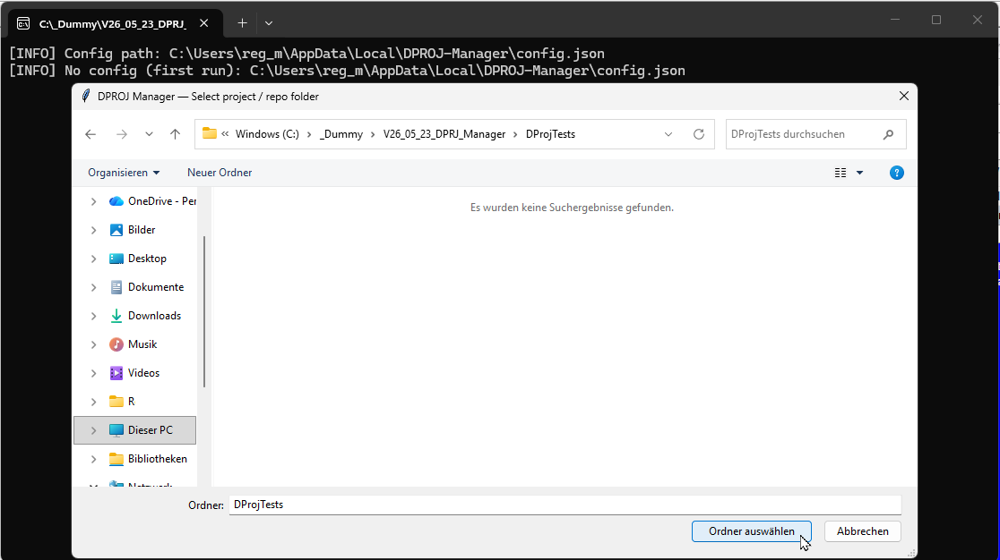

---


## Usage

### Basic workflow

At first start, the local server runs and asks for them ain repo folder in which you can place test files.
This config file is stored unter %localappdata\%DPROJ-Manager, there are no other files or folders touched,
except the local files of DPROJ-Manager folder.

1. **Load two files**. Click `File...` on the Left, browse to your file, then
   click `Load`. Repeat for the Right side.

   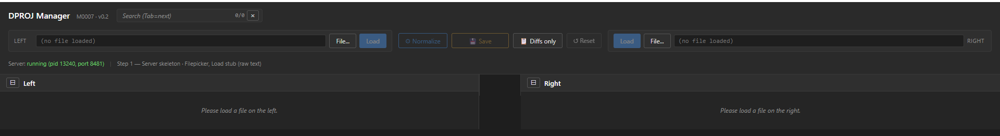

   Select left file, as origin
   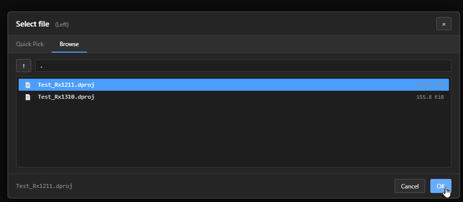
   
   Select right file, as new target
   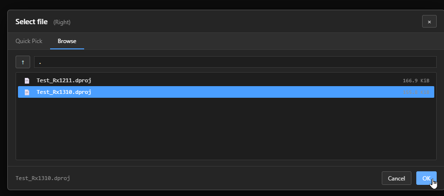
   
   Load the files into the viewer
   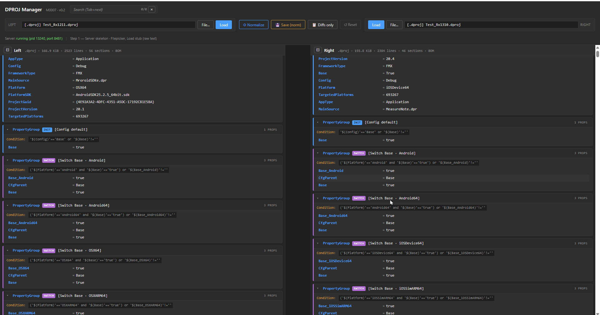
   
2. **Click `⚙ Normalize`**. Both files are read, normalized, and compared. The
   result is a unified diff tree.
   
   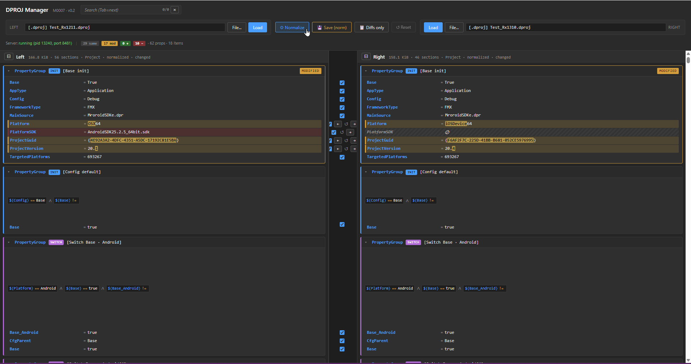
   
   Collapse or expand the property groups
   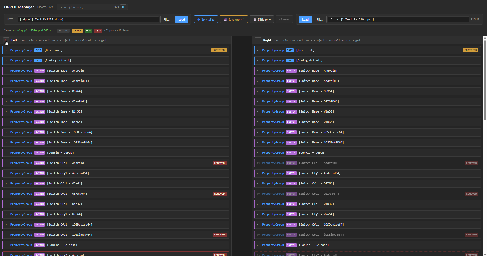
   
3. **Review differences**. Use the `↺ Diffs only` toggle (`Ctrl+D`) to hide
   identical sections.
      
4. **Pick changes**. For each diff:
   - Click `→` (or `←`) in the middle column to **copy** the value to the
     other side.
   - Click `↺` to **reset** a previous apply.
   - Use the per-row checkbox to **disable** a property (it will be removed
     on Save).
   
   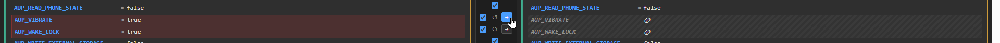
   
   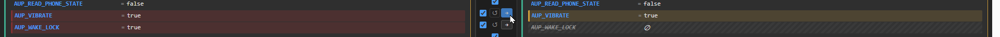
   
   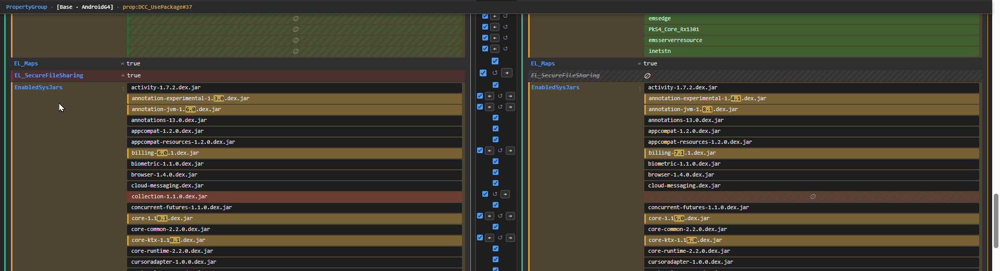
   
   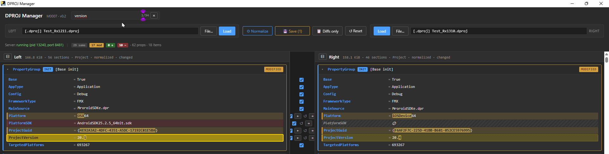
   
   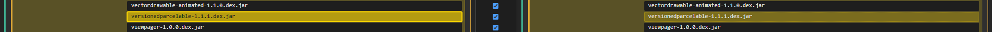
   
   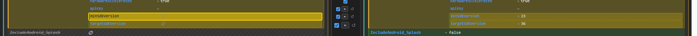
      
5. **Save**. Click `💾 Save` (`Ctrl+S`). The Save dialog lets you:
   - Choose Left, Right, or Both
   - Specify a `Save as:` filename, or leave empty to overwrite the original
     (a backup is written first)
   - Optionally force **platform sort** of `PropertyGroup`s
   - Optionally normalize the `ProjectExtensions` tree
   
   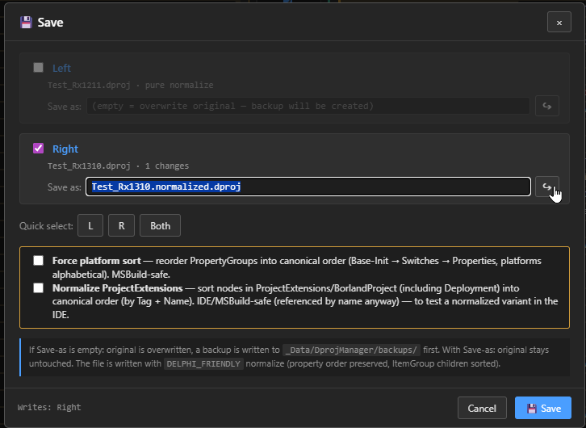
   
### Keyboard shortcuts

| Shortcut       | Action                                |
|----------------|---------------------------------------|
| `Ctrl+N`       | Normalize + diff                      |
| `Ctrl+S`       | Open Save dialog                      |
| `Ctrl+D`       | Toggle Diffs-only view                |
| `Ctrl+/`       | Expand / collapse all sections        |
| `Ctrl+F`       | Focus the search bar                  |
| `Tab` (search) | Jump to next match                    |
| `Shift+Tab`    | Jump to previous match                |
| `Esc` (search) | Clear search                          |

### Command-line flags

```text
DPROJ-Manager.exe [--pick] [--debug]

  --pick    Re-prompt for the workspace folder, overriding the saved one.
  --debug   Open WebView2 DevTools alongside the app window. Useful for
            inspecting layout / diagnosing UI issues.
```

---

## Architecture

```
┌──────────────────────────────────────────────────────────┐
│  DPROJ-Manager.exe                                       │
│  (PyInstaller-frozen Python 3.11+ launcher)              │
│                                                          │
│   ┌────────────────┐       ┌──────────────────────────┐  │
│   │  pywebview     │  ◄────┤  Microsoft Edge          │  │
│   │  (Edge backend)│  HTTP │  WebView2 Runtime        │  │
│   └────────────────┘ 127.* └──────────────────────────┘  │
│           │                                              │
│           ▼                                              │
│   ┌────────────────────────────────────────────────────┐ │
│   │  Starlette + Uvicorn (in-process daemon thread)    │ │
│   │    /api/files/scan    /api/dproj/normalize         │ │
│   │    /api/dproj/load    /api/dproj/save              │ │
│   │    /api/files/browse  /api/files/image             │ │
│   └────────────────────────────────────────────────────┘ │
│           │                                              │
│           ▼                                              │
│   ┌────────────────────────────────────────────────────┐ │
│   │  Dproj/  (Python package)                          │ │
│   │    tree.py        ─ MSBuild XML parser             │ │
│   │    normalize.py   ─ canonical / DELPHI_FRIENDLY    │ │
│   │    diff.py        ─ section + property diff        │ │
│   │    subvalues.py   ─ token & key-value diffs        │ │
│   │    platform_sort.py ─ PropertyGroup reorder        │ │
│   │    xmltree.py     ─ ProjectExtensions tree diff    │ │
│   │    save.py        ─ apply + write + backup         │ │
│   │  (lxml under the hood for everything XML)          │ │
│   └────────────────────────────────────────────────────┘ │
└──────────────────────────────────────────────────────────┘
```

The frontend (`www/app.js`, `index.html`, `style.css`) is pure
**vanilla JavaScript** — no framework, no build step, no bundler. The HTML
file is ~240 lines, the JS is ~3400 lines including the layout sync engine and
the diff renderer.

---

## Building from source

Requirements: **Python 3.11+**, [`uv`](https://docs.astral.sh/uv/) installed.

```bash
git clone https://github.com/Rollo62b/dproj-manager.git
cd dproj-manager
```

### Run from source (web mode, no EXE)

```bash
uv run python Src/__SubRoutines/Py/Dproj/launcher.py
```

Opens a pywebview window pointing at a local Uvicorn server. Add `--debug`
for DevTools, `--pick` to re-choose the workspace.

Alternatively, run the headless web mode:

```bash
Src\_Steps\0103_Dproj_Manager_Serve.cmd
```

Then open `http://localhost:8481/` in any browser.

### Build the Windows EXE

```bash
Src\_Steps\0110_Build_Exe.cmd
```

The script invokes PyInstaller with the manifest at
`Src/__SubRoutines/Py/Dproj/DPROJ-Manager.spec` and produces
`Bin/DPROJ-Manager/` ready to zip and ship.

### Run tests

```bash
uv run --group test pytest
```

Tests cover the normalizer (~155 tests), the section/property diff, the XML
node tree, subvalues handling, and the CLI.

---

## Project status

DPROJ Manager grew out of an internal milestone series (M0005 through M0008)
to support a multi-RadStudio-version migration. It is **production-tested**
against an internal codebase with 56-section dprojs, and is **usable today**
for any Delphi project file. The roadmap includes:

- **macOS build** (PyInstaller on macOS, WKWebView via pywebview) — in progress
- **Workspace session persistence** — restore selected files / view state
  after restart
- **Manual node moves** in the ProjectExtensions tree (today reorder is only
  via canonical normalize)

---

## License

DPROJ Manager is released under the **MIT License** — see [LICENSE](LICENSE)
for the full text.

Third-party components bundled in the distributed EXE are listed in
[THIRD_PARTY_NOTICES.txt](THIRD_PARTY_NOTICES.txt) with their respective
licenses (mostly BSD-3-Clause and MIT).

---

## Trademarks

**DPROJ Manager is an independent open-source project. It is not affiliated
with, endorsed by, or sponsored by Embarcadero Technologies, Inc., Microsoft
Corporation, or the Python Software Foundation.**

- *Delphi*, *RAD Studio*, and *Embarcadero* are registered trademarks of
  Embarcadero Technologies, Inc.
- *Windows*, *Microsoft Edge*, and *WebView2* are trademarks of Microsoft
  Corporation.
- *Python* is a trademark of the Python Software Foundation.
- All other trademarks are the property of their respective owners.

---

## Acknowledgements

DPROJ Manager stands on the shoulders of excellent open-source projects.
Special thanks to the maintainers of:

- [**lxml**](https://lxml.de/) — fast, lenient MSBuild XML parsing
- [**Starlette**](https://www.starlette.io/) +
  [**Uvicorn**](https://www.uvicorn.org/) — minimal, fast ASGI stack
- [**pywebview**](https://pywebview.flowrl.com/) — native WebView shell
  without bundling a browser
- [**PyInstaller**](https://pyinstaller.org/) — Python-to-EXE packager
- [**uv**](https://docs.astral.sh/uv/) — fast Python project management

Built and maintained by [@Rollo62b](https://github.com/Rollo62b).
